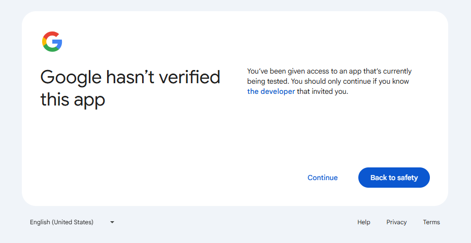
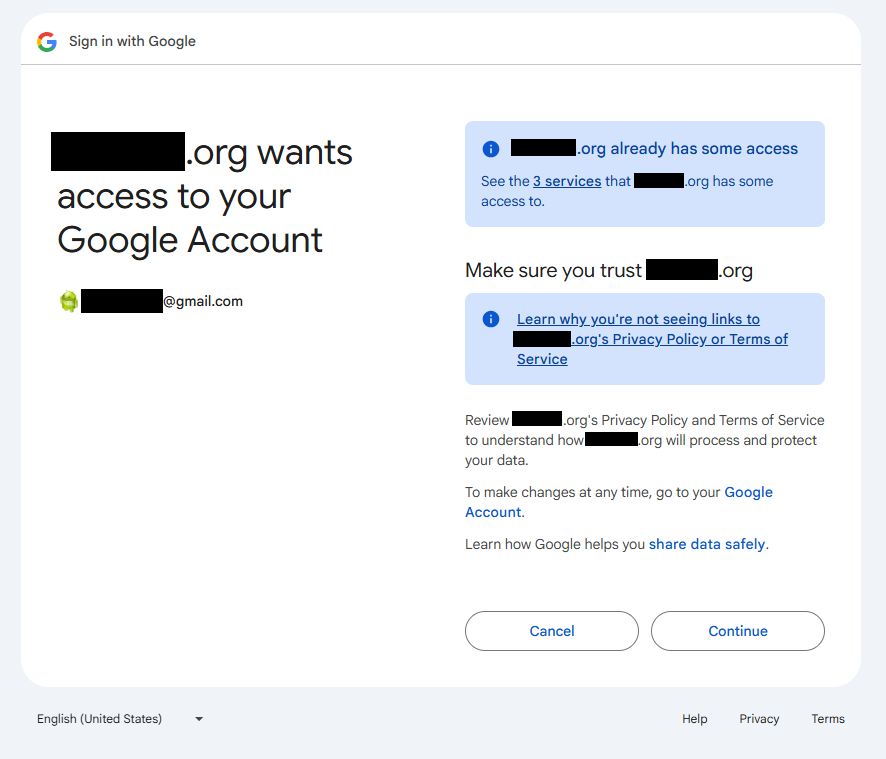

# Orca Photo Share (REDCap External Module) 

As the name implies, this external module pulls approved images/gifs/videos that are shared via REDCap survey and publishes them to a Google Photos Album. 

# Introduction

I tried to do my best to describe the overall process, as I went through it.  Some steps may not match exactly what you experience, but they should be close enough to get you through and complete the setup.

# Requirements

## Linux-based environments

You need to install and enable the following PHP Extension, if not already installed:

- BCMath
 
> **NOTE:** You may need to target your PHP version
> 
> `sudo apt install php8.3-bcmath # Example for PHP 8.3`

This is required by the Google libraries during the upload process.

*Windows-based PHP installs have built-in support, so they don't need the explicit extension to be installed.*

## Having a Google Account!

Ensure you have a Google Account that you have full control of.  With this account, you will need:

- Ability to create and manage a Photos Album
  - **The album has to be created by the API code, so do not create one ahead of time!**
- Access to https://console.cloud.google.com/
  - This is for configuring the integration between the REDCap EM and the Photos API
- The account must have enough cloud storage space available for the album
  - For reference, The 562 images in the RCC25 album is at most only a few GB

# Setup

## Step 1 - Creating your REDCap Project

This module depends on specific fields existing with specific values, when processing photos for upload.

> **NOTE:** Refer to the latest release in GitHub for a Project XML that you can use to get started!
> https://github.com/dr01d3r/redcap-em-orca-photo-share/releases

- [`file_picture`]
  - Field Type: `file`
  - The file upload field that the images get uploaded to.
- [`share`]
  - Field Type: `radio` or `yesno`
  - An acknowledgement field by the submitter to allow us to share their image.
- [`approve`]
  - Field Type: `yesno`
  - An acknowledgement field by a reviewer to approve the submission for upload to the album.
  - This should exist on a form separate from the survey instrument or `@HIDDEN-SURVEY`.
- [`google_photo`]
  - Field Type: `yesno`
  - A behind-the-scenes field the to track images that have already been uploaded to the album.

## Step 2 - Enabling the Module

Subsequent steps will require information that the module's configuration will provide to you after enabling it in your project.

- After enabling the module, navigate to the "Google Photos Configuration" page and take note of the following values:
   - **Base Domain**
      - This is the base domain of your instance of REDCap
      - **NOTE:** Be sure to verify this value! The code to determine this may not be 100% accurate if you have a very customized domain/URL.
   - **Redirect URI**
      - This is a URL callback to the module that will be used for the initial authorization step (after you've obtained your Client ID and Secret)

## Step 3 - Google Cloud Console

Using the Google account that will host the Photos Album, use the link below to get to the Google Cloud Console.

https://code.google.com/apis/console

### Creating the Project

First you need to Create a Project.  Don't worry about the name too much, but be descriptive, so you know what it means later on.

### Configuring the OAuth Consent

Click "OAuth consent screen" in the left sidebar (you may also see an alert that will take you to the "Configure consent screen").

#### Initial Setup (Branding)

- App Information
   - App name
   - User support email (the email associated with the Google account)
- Audience
   - Select External
   - Contact Info
- Finish!

#### Branding

- Under "Authorized domains", add the REDCap domain that the EM will be hosted on
- Click Save!

#### Audience

- Under "Test users", add your Google email
- Click Save!

#### Clients

Here, we'll click on "Create client"
- Web application
   - Name can stay the default value
- Authorized redirect URIs
   - Grab the "Redirect URI" value from the EM Configuration page.
- Click Create!
- **IMPORTANT!**
   - The "Client ID" and "Client secret" are required for the EM to function.
   - Copy their values into a text document or click the "Download JSON" button.
   - **NOTE:** The Client secret is only available to copy/download for a short period of time

#### Data Access

- Here you'll need to add the scope of authorization that the EM needs to do the integrations
- Using the Scopes from the EM Configuration page, either search the table or just copy/paste them into the "Manually add scopes" section.

```
https://www.googleapis.com/auth/photoslibrary.edit.appcreateddata,
https://www.googleapis.com/auth/photoslibrary.readonly.appcreateddata,
https://www.googleapis.com/auth/photoslibrary.appendonly
```

- If you manually added, be sure to click "Add to table"
- Click Update!
- Click Save!

#### Photos Library API

Back on your Google Cloud home page, in the "APIs & Services" section, search for the "Photos Library API" and Enable it (if not already enabled by default).

## Step 4 - Client Info & Authorization (in REDCap)

Now that we have the Client ID and Secret, we need to provide those values to the module, so it can then trigger the authorization process.

- Back in the Google Photos Configuration page, click on the "Edit client Info" button.  In the pop-up, provide your Client ID and Client Secret values and click Save.
  - As noted, a new Authorization Request will be initiated.  You'll be automatically taken to a Google page to authorize your REDCap domain to interact with your Google Account, using the scopes we defined earlier.
  - You'll be prompted with a warning that the app is in test mode.
    - Click "Continue"
  - 
  - The next prompt will mention the scopes being requested.
    - ***NOTE**: In my screenshot below, I've already gone through the process once, so you likely won't see the top section that indicates it "already has some access..."*
  - Click "Continue"
  - 
  - This should bring you back to the REDCap config page and you should see a success message that a Refresh Token was generated!

### Refreshing your Token!

Because we're running this app in "testing" mode, Refresh Tokens have a 7-day lifespan and must be renewed regularly.  This cannot be automated either, so manual intervention is necessary.

- On the configuration page, there's a convenient refresh button next to the Refresh Token.
- Clicking it will take you back through the same authorization process as above.

## Step 5 - Album Configuration

Now that you have a valid refresh token, you can create the Album that images will be uploaded to.

- You should now be able to click the "Edit Album Info" button at the bottom of the config page.
- You'll get a dialog that prompts you for an album name.
- Provide a name and click "Save".
  - This will send a request to Google to create the album.  If successful, an Album ID will be returned and stored in REDCap.

---

## Uploading Images to the Album

Congratulations!  Now you're ready to upload images to the album.

### Requirements

For an image to be eligible for upload, the following filter logic is used:

- `[file_picture] <> '' AND [share] <> '0' AND [approve] = '1' AND [google_photo] <> '1'`
  - The upload field must have a value
  - The submitter did not decline sharing
  - Someone reviewed and approved the image for upload
  - The image hasn't already been uploaded

Additionally, your configuration must be valid; otherwise, the upload process will not run.

- Client ID and Client Secret cannot be blank
- Refresh Token cannot be blank and it cannot be expired
- The Album ID cannot be blank 

### Automated and Manual Upload

Images can be uploaded in one of two ways:

- The automated cron job
  - This runs on a 30-minute interval, based on whenever the module was enabled in the project.
  - For this to run, it must be enabled in the built-in module config
    - Click on the "Manage" link in the External Modules section of the left-hand sidebar
    - Click the "Configure" button for this module
    - For "Cron Job Enabled" select "Enabled" in the dropdown and click "Save"
- The manual "Google Photos Runner" plugin page
  - This is a simple interface that allows you to initiate the upload process whenever you want!

---